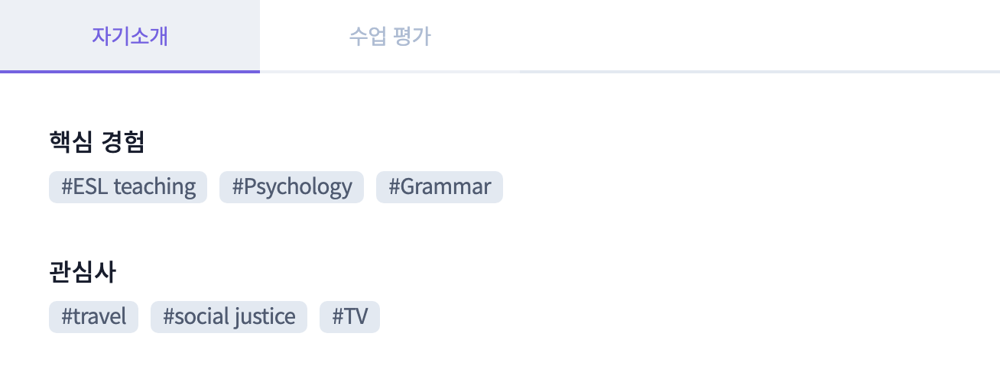

# :capital_abcd: Ringle Tutor Analysis

## :books: 목차

- [:tada: 소개](#tada-소개)
  - [도입](#도입)
  - [라이선스](#라이선스)
  - [구성](#구성)
- [:rocket: 사용법](#rocket-사용법)
  - [패키지](#패키지)
  - [실행 방법](#실행-방법)
- [:white_check_mark: To Do](#white_check_mark-to-do)

### :tada: 소개

#### 도입

본 프로젝트는 1:1 화상영어 수업 서비스 [링글](https://www.ringleplus.com/)에서 주최한 [제3회 서비스 기획 공모전](https://ringle.notion.site/Ringle-3-ca5b32bf33914c0085e2403ff37456e3)의 근거 데이터로 활용하기 위해 팀 **Ring!ng**에서 링글의 튜터 정보를 파싱하기 위해 제작되었습니다.

현재 링글 서비스는 튜터가 서술형으로 답변한 결과를 토대로 자연어 처리(NLP_Natural Language Processing) 기술을 활용해 단어를 추출하여 아래 이미지와 같이 **핵심 경험** 및 **관심사** 정보로 제공하고 있습니다.

#### 라이선스

모든 데이터에 대한 라이선스는 링글에 있습니다.
코드에 대한 라이선스는 [LICENSE](./LICENSE) 파일을 확인해주세요.

#### 구성

본 프로젝트는 `src` 디렉토리 내에 `api`, `core`, `util` 디렉토리 구조로 구성되어 있으며 해당 코드를 토대로 실제 애플리케이션을 실행시키는 [main.py](./src/main.py) 파일이 존재합니다.

먼저 `api` 디렉토리의 경우 링글 서비스의 튜터 정보를 조회하는 API를 호출하여 튜터의 정보를 얻는 함수인 `get_tutors_information`이 작성되어 있는 [tutor.py](./src/api/tutor.py) 파일이 존재합니다.

다음으로 `core` 디렉토리의 경우 링글 서비스의 튜터 정보 조회 엔드포인트 및 토큰 정보가 담겨 있는 객체 `Settings` 및 이를 캐싱하여 호출하는 함수 `get_settings`가 작성되어 있는 [cofig.py](./src/core/config.py) 파일이 존재합니다.

끝으로 `util` 디렉토리의 경우 튜터의 정보를 통해 얻게 된 관심사 데이터의 통계를 내기 위한 함수 `update_interests`가 작성되어 있는 [worker.py](./src/util/worker.py) 파일이 존재합니다.

### :rocket: 사용법

#### 패키지

[poetry](https://python-poetry.org/)를 활용하여 패키지를 관리하였습니다.

`poetry install` 명령어를 통해 [pyproject.toml](./pyproject.toml) 파일에 작성된 필요 패키지를 설치할 수 있습니다.

이때 [pre-commit](https://pre-commit.com/)과 같이 개발 단계에서 포맷팅 등을 위해 활용되는 패키지를 설치하지 않고 제품 단계에서의 패키지만 설치하기 위해서는 뒤에 `--no-dev` 옵션을 붙여 `poetry install --no-dev` 명령어를 실행하면 됩니다.

애플리케이션을 실행하기 위해 필수적으로 필요한 패키지는 `pydantic`, `python-dotenv`, `requests`입니다.

#### 실행 방법

`python -m src.main` 명령어를 통해 애플리케이션을 실행할 수 있습니다.

### :white_check_mark: To Do

애플리케이션을 실행한 결과를 보면 `Food` 및 `Cooking` 결괏값을 확인할 수 있습니다.

이처럼 비슷한 범주 내에 존재하는 단어의 경우 **단어 유사도(Text Similarity)** 를 활용하여 기계 학습(Machine Learning)을 통해 동일한 범주로 묶을 수 있습니다.
